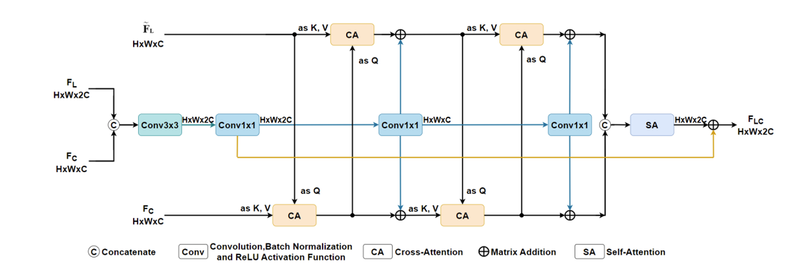

# HACIFusion-BEV

> Hybrid Attention and Convolutional Induction Fusion for LiDAR-Camera BEV perception.

## 中文说明

本仓库是在北京大学 BEVFusion 代码基础上整理的硕士课题研究代码，面向自动驾驶场景中的 LiDAR-Camera BEV 多模态融合与 3D 目标检测。

原始参考框架为 **BEVFusion: A Simple and Robust LiDAR-Camera Fusion Framework**。在其 BEV 空间融合范式上，本项目进一步实现了一个面向复杂道路场景的混合注意力与卷积归纳融合模块，对应论文：

- **Hybrid Attention and Convolutional Induction Network for LiDAR-Camera BEV Fusion in Complex Road Scenes**
- DOI: https://doi.org/10.1049/itr2.70273

详细实验结果、消融实验和对比实验请参考论文正文；本 README 主要概述方法结构、代码位置和复现命令。

### 主要创新

本项目的核心改动集中在 BEV 层面的多模态融合，而不是简单拼接 camera BEV 与 LiDAR BEV 特征。主要思想包括：



1. **LiDAR 位置先验引导的多头交叉注意力**
   - LiDAR BEV 特征具有更准确的几何和空间位置信息。
   - 在交叉注意力中，使用 LiDAR 相关特征作为 query，去检索融合特征中的 key/value。
   - 这样可以利用 LiDAR 的空间定位能力，从包含 camera 语义与 LiDAR 几何的融合特征中取回更有效的信息。

2. **卷积归纳偏置**
   - 将 camera BEV 与 LiDAR BEV 特征在 90 x 90 BEV 分辨率下进行拼接。
   - 通过 3 x 3 卷积和 1 x 1 卷积构造局部空间归纳特征。
   - 卷积分支提供局部连续性和空间邻域建模能力，弥补纯注意力机制对局部结构约束不足的问题。

3. **CA + SA 的混合注意力结构**
   - Cross-Attention 用于跨模态信息检索和交互。
   - Self-Attention 用于融合后 BEV token 的全局上下文建模。
   - 二者结合，使模型同时具备局部空间归纳、跨模态检索和全局关系建模能力。

4. **可学习的融合权重 `weight1`**
   - 代码中 `weight1` 是可学习参数，并通过 `torch.sigmoid(self.weight1)` 得到实际融合权重。
   - 实验记录中的 `0.4844` 表示训练后学到的 `sigmoid(weight1)` 数值，不是手工写死的超参数。

### 关键文件

- 模型实现：
  - `mmdet3d/models/detectors/bevf_faster_rcnn_aug.py`
- 主要训练配置：
  - `configs/bevfusion/bevf_tf_4x8_10e_nusc_aug.py`

### 通道与分辨率假设

当前研究分支对应的主配置为：

- camera BEV channel: `imc = 256`
- LiDAR BEV channel: `lic = 256 * 2 = 512`
- 融合分支分辨率：`90 x 90`

模型文件中的卷积层和位置编码与上述设置匹配。如果更换 backbone、BEV 分辨率或通道数，需要同步修改 `bevf_faster_rcnn_aug.py` 中的 256/512 通道设置以及 `8100 = 90 x 90` 的位置编码长度。

### 训练环境

论文实验环境如下：

- GPU：4 x NVIDIA GeForce RTX 3090
- OS：Ubuntu 20.04.3
- CUDA：11.1
- PyTorch：1.8.0
- MMDetection：2.11.0
- MMDetection3D：0.11.0
- Dataset：nuScenes

一个兼容的环境安装示例：

```bash
conda create -n hacifusion python=3.8 -y
conda activate hacifusion

pip install torch==1.8.0+cu111 torchvision==0.9.0+cu111 \
  -f https://download.pytorch.org/whl/torch_stable.html

pip install mmcv-full==1.3.8 \
  -f https://download.openmmlab.com/mmcv/dist/cu111/torch1.8.0/index.html
pip install mmdet==2.11.0
pip install mmdet3d==0.11.0

pip install -r requirements.txt
python setup.py develop
```

### 数据准备

将 nuScenes 数据集放置或软链接到 `data/nuscenes`，然后生成训练信息文件：

```bash
mkdir -p data
ln -s /path/to/nuscenes data/nuscenes

python tools/create_data.py nuscenes \
  --root-path ./data/nuscenes \
  --out-dir ./data/nuscenes \
  --extra-tag nuscenes
```

### 详细训练命令

当前主融合配置会加载 LiDAR 分支和 Camera 分支的预训练权重：

- `./work_dirs/transfusion_nusc_voxel_L/epoch_20.pth`
- `./work_dirs/bevf_tf_4x8_20e_nusc_cam_lr/bevf_tf_4x8_20e_nusc_cam_lr/epoch_20.pth`

因此推荐按以下顺序训练。

1. 训练 LiDAR-only TransFusion 分支：

```bash
CUDA_VISIBLE_DEVICES=0,1,2,3 \
./tools/dist_train.sh configs/bevfusion/lidar_stream/transfusion_nusc_voxel_L.py 4
```

2. 训练 Camera BEV 分支：

```bash
CUDA_VISIBLE_DEVICES=0,1,2,3 \
./tools/dist_train.sh configs/bevfusion/cam_stream/bevf_tf_4x8_20e_nusc_cam_lr.py 4
```

3. 训练本文 HACIFusion-BEV 主融合模型：

```bash
CUDA_VISIBLE_DEVICES=0,1,2,3 \
./tools/dist_train.sh configs/bevfusion/bevf_tf_4x8_10e_nusc_aug.py 4
```

`tools/dist_train.sh` 会自动生成分布式端口。如果使用 8 张 GPU，可将 `CUDA_VISIBLE_DEVICES` 和最后的 GPU 数量改为 8，并同步检查配置中的 `gpu_ids`。主配置当前设置为 `gpu_ids=range(0, 4)`、`samples_per_gpu=1`、`workers_per_gpu=6`、`total_epochs=10`，优化器为 AdamW。

### 精简上传说明

为了突出论文主线，本仓库建议只保留以下核心内容上传：

- `configs/`
- `mmdetection-2.11.0/`
- `mmdet3d/`
- `mmcv_custom/`
- `research_extras/`
- `tools/`
- `requirements/`
- `requirements.txt`
- `setup.py`
- `setup.cfg`
- `MANIFEST.in`
- `LICENSE`
- `README.md`

其中 `research_extras/` 用于单独保留硕士课题期间探索过但主训练配置默认不依赖的代码，包括 `vit_deformable_attention/` 和 `deformable_attention_ops/ops/`。

### 许可证与声明

本仓库保留原始 BEVFusion / OpenMMLab 风格的 Apache-2.0 许可证文件。请查看：

- `LICENSE`
- `NOTICE`

`NOTICE` 中说明了本仓库基于 BEVFusion 的研究扩展关系，以及本文新增的 HACIFusion-BEV 融合模块和 `research_extras/` 探索代码。

### 致谢

本项目基于北京大学 BEVFusion 代码框架进行研究扩展。感谢原始 BEVFusion 作者开源的优秀工作：

```bibtex
@inproceedings{liang2022bevfusion,
  title={{BEVFusion: A Simple and Robust LiDAR-Camera Fusion Framework}},
  author={Tingting Liang, Hongwei Xie, Kaicheng Yu, Zhongyu Xia, Zhiwei Lin, Yongtao Wang, Tao Tang, Bing Wang and Zhi Tang},
  booktitle = {Neural Information Processing Systems (NeurIPS)},
  year={2022}
}
```

## English

This repository contains research code from a master's thesis project built on top of the Peking University BEVFusion codebase. It focuses on LiDAR-Camera BEV fusion for 3D object detection in autonomous-driving scenarios.

The baseline framework is **BEVFusion: A Simple and Robust LiDAR-Camera Fusion Framework**. On top of the original BEV-space fusion pipeline, this project implements a hybrid attention and convolutional induction module for complex road scenes:

- **Hybrid Attention and Convolutional Induction Network for LiDAR-Camera BEV Fusion in Complex Road Scenes**
- DOI: https://doi.org/10.1049/itr2.70273

Detailed experimental results, ablation studies, and comparison experiments are reported in the paper. This README focuses on the method overview, code structure, and reproduction commands.

### Main Contributions

The main research change is a BEV-level multimodal fusion module rather than a plain concatenation of camera BEV and LiDAR BEV features.


1. **LiDAR-position-guided multi-head cross-attention**
   - LiDAR BEV features provide accurate geometric and spatial priors.
   - In the cross-attention module, LiDAR-related features are used as queries to retrieve information from fused key/value features.
   - This allows the model to use accurate LiDAR positions to select semantic and geometric cues from the fused BEV representation.

2. **Convolutional induction bias**
   - Camera BEV and LiDAR BEV features are concatenated at the 90 x 90 BEV resolution.
   - A 3 x 3 convolution and 1 x 1 convolutions are used to build local inductive features.
   - The convolutional branch supplies locality and neighborhood continuity, complementing the global nature of attention.

3. **Hybrid CA + SA structure**
   - Cross-Attention performs cross-modal retrieval and interaction.
   - Self-Attention models global context over the fused BEV tokens.
   - The combination provides local induction, multimodal retrieval, and global BEV reasoning.

4. **Learnable fusion weight `weight1`**
   - `weight1` is a learnable parameter.
   - The effective fusion coefficient is computed by `torch.sigmoid(self.weight1)`.
   - The value `0.4844` in the experiment notes is the learned `sigmoid(weight1)` value after training, not a manually fixed hyperparameter.

### Key Files

- Model implementation:
  - `mmdet3d/models/detectors/bevf_faster_rcnn_aug.py`
- Main training config:
  - `configs/bevfusion/bevf_tf_4x8_10e_nusc_aug.py`

### Channel and Resolution Assumptions

The current research branch is aligned with the following settings:

- camera BEV channel: `imc = 256`
- LiDAR BEV channel: `lic = 256 * 2 = 512`
- fusion branch resolution: `90 x 90`

The convolution layers and positional embedding in `bevf_faster_rcnn_aug.py` are matched to these settings. If the backbone, BEV resolution, or channel dimensions are changed, the 256/512 channel settings and the `8100 = 90 x 90` positional-embedding length should be updated accordingly.

### Training Environment

The thesis experiments were conducted under the following environment:

- GPU: 4 x NVIDIA GeForce RTX 3090
- OS: Ubuntu 20.04.3
- CUDA: 11.1
- PyTorch: 1.8.0
- MMDetection: 2.11.0
- MMDetection3D: 0.11.0
- Dataset: nuScenes

A compatible installation example is:

```bash
conda create -n hacifusion python=3.8 -y
conda activate hacifusion

pip install torch==1.8.0+cu111 torchvision==0.9.0+cu111 \
  -f https://download.pytorch.org/whl/torch_stable.html

pip install mmcv-full==1.3.8 \
  -f https://download.openmmlab.com/mmcv/dist/cu111/torch1.8.0/index.html
pip install mmdet==2.11.0
pip install mmdet3d==0.11.0

pip install -r requirements.txt
python setup.py develop
```

### Data Preparation

Place or symlink the nuScenes dataset to `data/nuscenes`, then generate the dataset information files:

```bash
mkdir -p data
ln -s /path/to/nuscenes data/nuscenes

python tools/create_data.py nuscenes \
  --root-path ./data/nuscenes \
  --out-dir ./data/nuscenes \
  --extra-tag nuscenes
```

### Detailed Training Commands

The main fusion config loads pretrained LiDAR and camera branch checkpoints:

- `./work_dirs/transfusion_nusc_voxel_L/epoch_20.pth`
- `./work_dirs/bevf_tf_4x8_20e_nusc_cam_lr/bevf_tf_4x8_20e_nusc_cam_lr/epoch_20.pth`

The recommended training sequence is:

1. Train the LiDAR-only TransFusion branch:

```bash
CUDA_VISIBLE_DEVICES=0,1,2,3 \
./tools/dist_train.sh configs/bevfusion/lidar_stream/transfusion_nusc_voxel_L.py 4
```

2. Train the Camera BEV branch:

```bash
CUDA_VISIBLE_DEVICES=0,1,2,3 \
./tools/dist_train.sh configs/bevfusion/cam_stream/bevf_tf_4x8_20e_nusc_cam_lr.py 4
```

3. Train the proposed HACIFusion-BEV fusion model:

```bash
CUDA_VISIBLE_DEVICES=0,1,2,3 \
./tools/dist_train.sh configs/bevfusion/bevf_tf_4x8_10e_nusc_aug.py 4
```

`tools/dist_train.sh` automatically generates the distributed port. For an 8-GPU machine, change `CUDA_VISIBLE_DEVICES` and the final GPU number to 8, and check `gpu_ids` in the config accordingly. The main config uses `gpu_ids=range(0, 4)`, `samples_per_gpu=1`, `workers_per_gpu=6`, `total_epochs=10`, and AdamW.

### Slim Release Scope

To keep the open-source upload focused on the thesis contribution, this repository keeps the core files only:

- `configs/`
- `mmdetection-2.11.0/`
- `mmdet3d/`
- `mmcv_custom/`
- `research_extras/`
- `tools/`
- `requirements/`
- `requirements.txt`
- `setup.py`
- `setup.cfg`
- `MANIFEST.in`
- `LICENSE`
- `README.md`

The `research_extras/` directory separately preserves exploratory code from the master's project that is not required by the default main training config, including `vit_deformable_attention/` and `deformable_attention_ops/ops/`.

### License And Notice

This repository keeps the original BEVFusion/OpenMMLab-style Apache-2.0 license file. Please see:

- `LICENSE`
- `NOTICE`

The `NOTICE` file describes the relationship to the original BEVFusion codebase, the added HACIFusion-BEV fusion module, and the exploratory code under `research_extras/`.

### Acknowledgement

This project is a research extension of the Peking University BEVFusion framework. Please cite the original BEVFusion work when using this codebase:

```bibtex
@inproceedings{liang2022bevfusion,
  title={{BEVFusion: A Simple and Robust LiDAR-Camera Fusion Framework}},
  author={Tingting Liang, Hongwei Xie, Kaicheng Yu, Zhongyu Xia, Zhiwei Lin, Yongtao Wang, Tao Tang, Bing Wang and Zhi Tang},
  booktitle = {Neural Information Processing Systems (NeurIPS)},
  year={2022}
}
```
